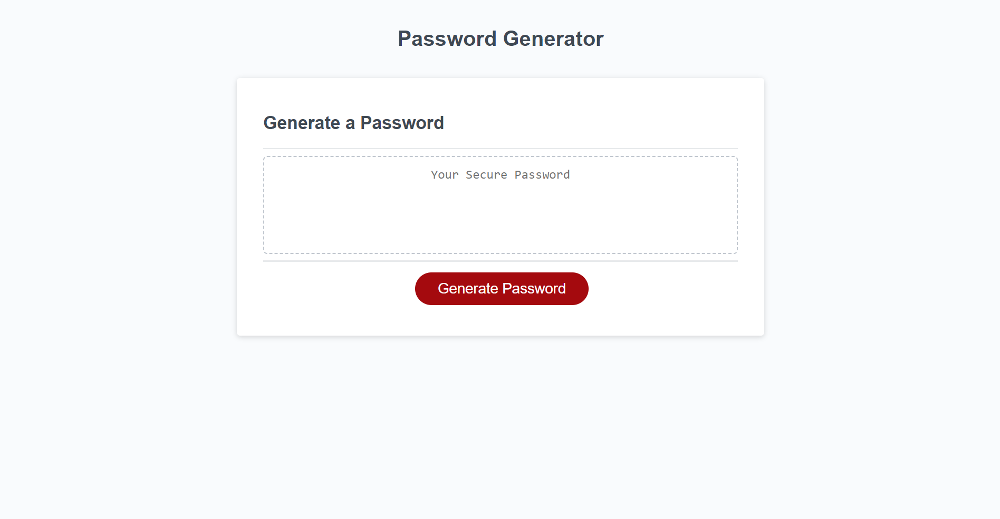

# Password Generator

## Description

This website features a password generator.

## Installation

Load the website on a web browser using the following link: https://monysary.github.io/Module-3-Challenge-Password-Generator/

## Usage

The password generator allows users to generate as many independent passwords as they need.

Generate a password by selecting the red "Generate Password" button. This will enable a set of prompts to appear, allowing the user to select specific characteristics for their password. Once the prompts are answered, a randomly generated password will display in the text box under "Generate a Password".

The passwords shall also meet the following requirements: a minimum character length of 8, maximum character length of 128, and a minimum of one character type.

## Credits

N/A

## License

N/A